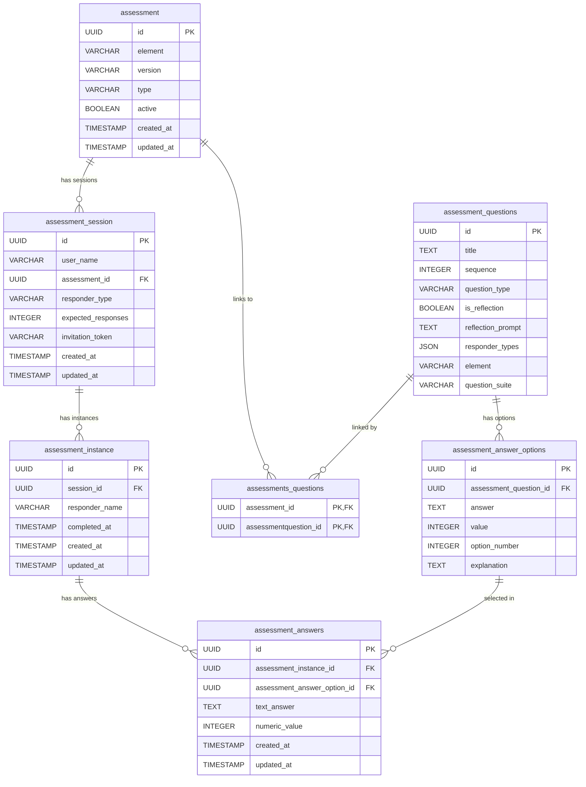

# Assessment Domain - Entity Relationship Diagram

## Diagram (Mermaid)

## Description

The assessment domain follows a hierarchical structure for managing educational self-assessments:

1. **Assessment** is the top-level template that defines which element (e.g., "1.1") is being evaluated. It links to questions through a many-to-many join table (`assessments_questions`), allowing questions to be reused across assessments.

2. **Assessment Questions** represent individual questions. Each can be a Likert-scale question (with predefined answer options scored 1-5) or a reflection/text question (no scoring). Questions have a sequence number for ordering and an element tag for grouping.

3. **Assessment Answer Options** are the predefined choices for Likert questions. Each option has a text label, a numeric value (1-5), and an optional explanation. They belong to exactly one question.

4. **Assessment Session** represents a "testing event" created by a user. It references one assessment template and tracks the responder type and expected number of responses.

5. **Assessment Instance** is one person's attempt at completing the assessment within a session. It tracks the responder name and completion status.

6. **Assessment Answers** store the actual responses. For Likert questions, they reference an answer option. For reflection questions, they store free text. Each answer belongs to one instance.

### Key Relationships
- Assessment ↔ Questions: **Many-to-Many** (via `assessments_questions`)
- Assessment → Sessions: **One-to-Many**
- Session → Instances: **One-to-Many**
- Instance → Answers: **One-to-Many**
- Question → Answer Options: **One-to-Many**
- Answer Option → Answers: **One-to-Many** (an option can be selected by multiple answers)
